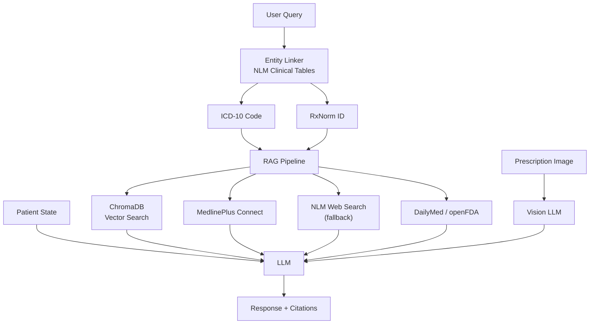

# Cancer Care AI — RAG-Powered Medical Information Assistant

A **Retrieval-Augmented Generation (RAG)** system that grounds AI responses in official NIH / NLM medical literature. Designed for cancer patients and caregivers — provides accurate, empathetic, citation-backed answers using MedlinePlus, DailyMed, and openFDA data.

## Table of Contents
- [Architecture Overview](#architecture-overview)
- [RAG Pipeline](#rag-pipeline)
- [Features](#features)
- [Project Structure](#project-structure)
- [Getting Started](#getting-started)
- [Provider Configuration](#provider-configuration)
- [Usage](#usage)
- [Requirements](#requirements)
- [Troubleshooting](#troubleshooting)
- [References](#references)

---

## Architecture Overview

| Component | Description |
|---|---|
| **LLM** | Provider-agnostic — OpenAI, Anthropic, Gemini, Groq, DeepSeek, Together, Ollama, or any OpenAI-compatible endpoint |
| **RAG Pipeline** | 4-stage retrieval: Entity Linking → Vector Search → MedlinePlus Connect → NLM Web Search fallback |
| **Entity Linker** | NLM Clinical Tables API — maps text to ICD-10-CM and RxNorm codes |
| **Vector Store** | ChromaDB (built from MedlinePlus XML dumps) |
| **Drug Labels** | DailyMed v2 + openFDA API |
| **Vision** | Multimodal LLM for handwritten prescription OCR with ambiguity detection |
| **Patient State** | Per-session JSON record tracking conditions, medications, and conversation history |

### Retrieval Flow



---

## RAG Pipeline

### Stage 1 — Entity Linking (NLM Clinical Tables)
- **ICD-10-CM Search:** `GET /api/icd10cm/v3/search?terms=lung+cancer` → `C34.90`
- **RxNorm Search:** `GET /api/rxterms/v3/search?terms=advil` → `209387`

### Stage 2 — Vector Search (ChromaDB)
- Semantic similarity on embedded MedlinePlus article chunks
- Enriched query: original text + extracted codes

### Stage 3 — MedlinePlus Connect
- Code-based article lookup via `https://medlineplus.gov/mplus/connect/retrieve`
- Returns ranked articles with titles, summaries, and URLs

### Stage 4 — NLM Web Search (Fallback)
- Direct text search: `https://wsearch.nlm.nih.gov/ws/query?db=healthTopics&term=...`
- Activated when vector + connect return empty results

---

## Features

| Feature | Detail |
|---|---|
| **Entity Linking** | `"lung cancer"` → `C34.90`, `"advil"` → RxNorm `209387` |
| **MedlinePlus RAG** | NIH consumer-health articles with source citations |
| **Drug Label Lookup** | FDA dosage, warnings, side effects via DailyMed + openFDA |
| **Prescription OCR** | Vision LLM reads handwriting; flags ambiguous text with alternatives |
| **Patient State** | JSON memory of conditions, medications, last 3 conversations |
| **Provider-Agnostic** | Swap LLMs via `.env` — no code changes |
| **Document Upload** | PDF, TXT reports + prescription images |
| **Multi-Input** | Text analysis + document analysis + image analysis simultaneously |

---

## Project Structure

```
Cancer-Care-AI/
├── model/
│   ├── app.py                       # Streamlit UI
│   ├── backend.py                   # FastAPI REST API
│   ├── prompts.py                   # System prompt template
│   ├── model_factory.py             # Provider-agnostic LLM factory
│   ├── entity_linker.py             # ICD-10 / RxNorm lookup
│   ├── patient_state.py             # JSON patient state
│   ├── medlineplus_retriever.py     # 4-stage RAG pipeline
│   ├── dailymed_retriever.py        # Drug label API client
│   ├── prescription_reader.py       # Vision OCR
│   ├── ingestion_pipeline.py        # XML → ChromaDB indexer
│   ├── Doc_retriver.py              # Wikipedia / Arxiv fallback
│   ├── well.py                      # Quick test
│   └── .env                         # Configuration
├── chroma_db/                       # Vector store (built by ingestion)
├── data/                            # MedlinePlus XML dumps
├── env/
│   └── requirements.txt
└── README.md
```

---

## Getting Started

### Prerequisites
- Python 3.11+
- API key from a supported LLM provider

### Installation

```bash
git clone https://github.com/VaibhavLande84/Cancer-Care-AI.git
cd Cancer-Care-AI
pip install -r env/requirements.txt
```

### Environment Variables (`model/.env`)

```env
LLM_PROVIDER=openai-compatible
OPENAI_COMPATIBLE_API_KEY=sk-...
OPENAI_COMPATIBLE_BASE_URL=https://api.aicredits.in/v1
OPENAI_COMPATIBLE_MODEL_NAME=gpt-4o
LLM_TEMPERATURE=0.7
LLM_MAX_RETRIES=2
VISION_MODEL_NAME=gpt-4o
```

### Run

```bash
streamlit run model/app.py
# Opens at http://localhost:8501
```

### API Backend

```bash
uvicorn model.backend:app --reload --port 8000
# Docs at http://localhost:8000/docs
```

### Build Vector Store (optional)

```bash
# Place MedlinePlus XML at: data/mplus_topics_2026-07-09.xml
python model/ingestion_pipeline.py
```

---

## Provider Configuration

Set `LLM_PROVIDER` in `.env` to one of:

| Provider | `LLM_PROVIDER` | Key Variable | Example Model |
|---|---|---|---|
| OpenAI | `openai` | `OPENAI_API_KEY` | `gpt-4o` |
| Anthropic | `anthropic` | `ANTHROPIC_API_KEY` | `claude-sonnet-4-20250514` |
| Google Gemini | `google-gemini` | `GEMINI_API_KEY` | `gemini-2.0-flash` |
| Groq | `groq` | `GROQ_API_KEY` | `llama-3.3-70b-versatile` |
| DeepSeek | `deepseek` | `DEEPSEEK_API_KEY` | `deepseek-chat` |
| Together | `together` | `TOGETHER_API_KEY` | `meta-llama/Llama-3.3-70B-Instruct-Turbo` |
| OpenAI-Compatible | `openai-compatible` | `OPENAI_COMPATIBLE_API_KEY` | Any model |
| Ollama (local) | `ollama` | *(none)* | `llama3` |

---

## Usage

### Web App
1. Enter patient details (cancer type, stage, treatments)
2. Type a question
3. Optionally upload a prescription image or doctor report
4. Click **Generate Result**

### REST API
```bash
curl -X POST http://localhost:8000/api/generate \
  -H "Content-Type: application/json" \
  -d '{
    "query": "lung cancer symptoms",
    "cancer_type": "Non-Small Cell Lung Cancer",
    "Patient_Question": "What should I watch for?"
  }'
```

Response includes `response`, `patient_state`, and `codes_found`.

---

## Requirements

```
langchain-openai
langchain-anthropic
langchain-groq
langchain-ollama
langchain-google-genai
langchain-core
langchain-community
streamlit
fastapi
chromadb>=0.4.0
requests
pypdf
```

Full list in `env/requirements.txt`.

---

## Troubleshooting

| Problem | Fix |
|---|---|
| `API key required` | Set key in `model/.env` for your provider |
| `NoneType` entity linker | API returned no results — handled gracefully now |
| Wikipedia/Arxiv errors | Non-critical — falls back to NLM Web Search |
| ChromaDB missing | Run `ingestion_pipeline.py` or ignore (uses Web Search) |
| Port in use | Streamlit auto-assigns next port |
| Vision fails | Provider must support multimodal (GPT-4o, Gemini, Claude) |

---

## References

- [MedlinePlus Connect](https://medlineplus.gov/connect/overview.html) — NIH
- [NLM Clinical Tables API](https://clinicaltables.nlm.nih.gov/) — ICD-10 / RxNorm search
- [DailyMed Web Services](https://dailymed.nlm.nih.gov/dailymed/webservices-help/v2/) — NIH
- [openFDA Drug Label API](https://open.fda.gov/apis/drug/label/) — FDA
- [NLM Web Search API](https://medlineplus.gov/webservices.html) — NIH
- [LangChain](https://www.langchain.com/) — LLM orchestration framework
- [ChromaDB](https://www.trychroma.com/) — Vector database

---

## Author

**Vaibhav Lande** — [GitHub](https://github.com/VaibhavLande84)

*Built for accessible, evidence-based cancer care information. Always consult a healthcare provider for medical decisions.*
